```{r setup, include=FALSE}
knitr::opts_chunk$set(echo = FALSE)
```

```{r eval=FALSE,echo=FALSE}
source("http://www.bioconductor.org/biocLite.R")
biocLite("ShortRead")
```


## Practical setup

Go to one of following Galaxy servers

- Surnames: A-K
    + https://bioinf-galaxian.erasmusmc.nl/galaxy/
- Surnames: L-N
    + https://galaxy.hidelab.org/
- Surnames: O-Z
    + http://services.cbib.u-bordeaux.fr/galaxy/

## Data Upload

- Go *Get Data*
    + *Upload File* (may be a different place on the menu depending which server you connect to!)
    
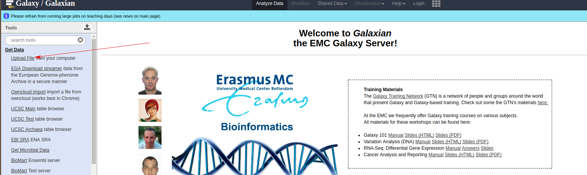

    
## Data Upload

- *Choose local file*
    + Select `JoeBlogsBRCAPanel_R1.fastq`, `JoeBlogsBRCAPanel_R2.fastq` and click **Start**
    
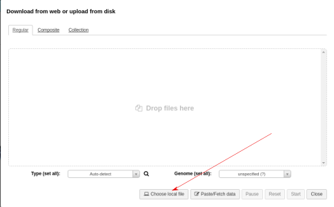

## Outline

- The *Fastq* format for sequencing reads
- Quality assessment of *fastq* files
- The *bam* format for representing *aligned* reads
- Stage 1 of an analysis *pipeline*

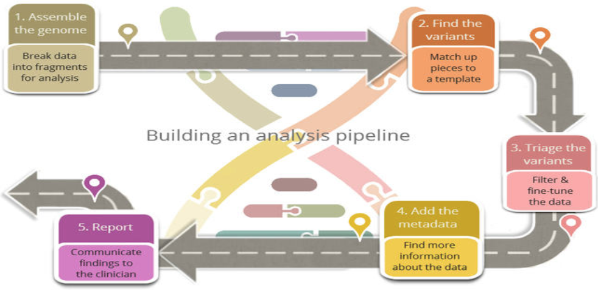


## The sequencing process

- [https://www.youtube.com/embed/HMyCqWhwB8E](https://www.youtube.com/embed/HMyCqWhwB8E) for a nice video
- sequencing consists of a series of *cycles* (e.g. 100), at each cycle we try and incorporate different bases (A, T, C, G)
- the base that is successfully added will illuminate brightly in a particular colour


## Imaging

- much of the sequening time is spent taking images of the flowcell
- it is these images that are used to discover what fragments of DNA were sequenced
- this process is not perfect and can introduce *uncertainty*

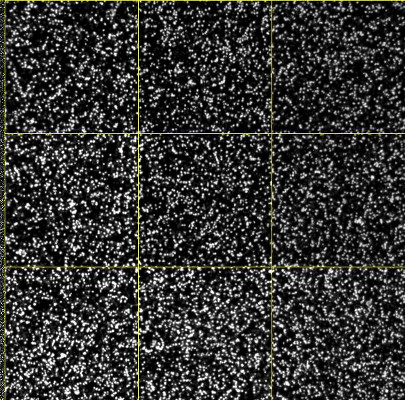

## Scale of data

Instrument  | No. of Reads | Size
------------- | ------------- | ---
Ion Torrent PGM  | 5 million reads | 1Gb
MiSeq  | 25 million reads | 6GB 
HiSeq rapid run  | 600 million | 150GB (*)
HiSeq high-output | 4 billion | 1 TB

* Equivalent to **40** HD movies
- File sizes are for 100 bp reads, unzipped
- Number of reads from thermofisher.com and illumina.com

## Fastq format

- a text file
- can be *compressed* as a gz file
- four lines per read
- the sequenced is most interesting, there are two other lines that we potentially investigate


## Sequence ID

Can contain the following

- name of sequencer
- flow cell *lane*
- coordinates of the read on the flow cell
- whether this is a *paired* read and whether it is read 1, or 2
- which biological sample the read came from (if multiple samples were sequenced on the same lane)

## Quality scores

- base-calling has some probability (`p`) that we make a mistake. 
- the quality score expresses our *confidence* in a particular base-call; higher quality score, higher confidence
- one such score for each base of sequencing. i.e. 100 scores for 100 bases of sequencing
- these are of importance if we want to call SNVs etc.
    + need to be sure that differences detected from the reference genome are real, and not caused by sequencing error
    
```
N?>:<9>>>:=;>>?<>:@?>;==@@@>?=AAA<>=A@?6>4B=<>>.@>?<@;?#############
```

## Deriving the Quality Score

First of all, we convert the base-calling probability (p) into a `Q` score using the formula

- Quality scores $$ Q = -10log_{10}p$$
    + Q = 30, p=0.001
    + Q = 20, p=0.01
    + Q = 10, p=0.1
- These numeric quanties are *encoded* as [**ASCII**](http://ascii-code.com/) code
    + At least 33 to get to meaningful characters
    (https://en.wikipedia.org/wiki/FASTQ_format)
    
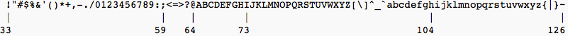      

## Quality Scores to probabilities

- look-up the ASCII code for each character
- subtract the offset to get the Q score
- convert to a probability using the formula:-

$$ p = 10^{-Q/10} $$

## Worked Example

for our particular example: 

```
N?>:<9>>>:=;>>?<>:@?>;==@@@>?=AAA<>=A@?6>4B=<>>.@>?<@;?#############
```

it works out as follows:-

```{r echo=FALSE,message=FALSE,warning=FALSE,comment=NA}
library(ShortRead)

pq <- PhredQuality("N?>:<9>>>:=;>>?<>:@?>;==@@@>?=AAA<>=A@?6>4B=<>>.@>?<@;?#############")
code <- as.integer(charToRaw(as.character(pq)))
qs <- code-33
probs <- 10^(unlist(qs)/-10)

df <- data.frame(Character = unlist(strsplit(as.character(pq),"")), Code = code, "Minus Offset (33) " = code -33,Probability = round(probs,5))
df[1:10,]
cat("...")
cat("...")
df[58:68,]
```


## Exercise

- Use the Galaxy tool *Text Manipulation* -> *Select last*

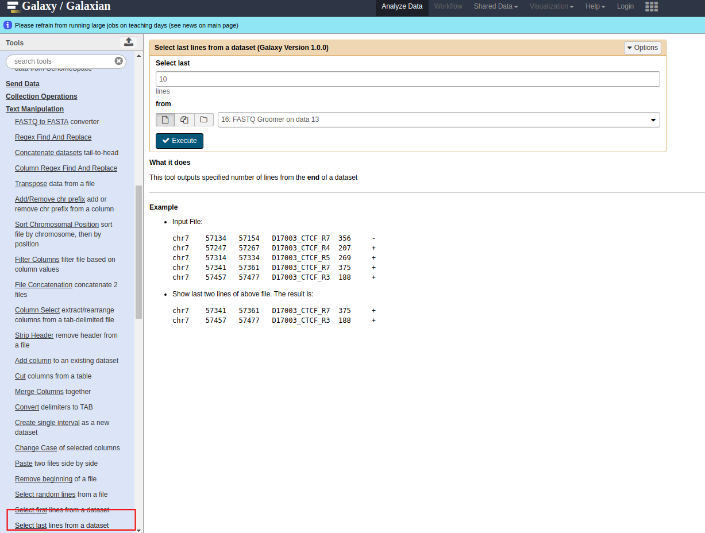


## Exercise

- print the last *12* lines from the file `JoeBlogsBRCAPanel_R2.fastq`
- how many reads are shown in the result?
- Look at the last read and write down the first five and last five ASCII characters
    + is the quality greater at the start, or the end of the read?
    
## Exercise

- Use the Galaxy tool *Text Manipulation* -> *Line/Word/Character count*

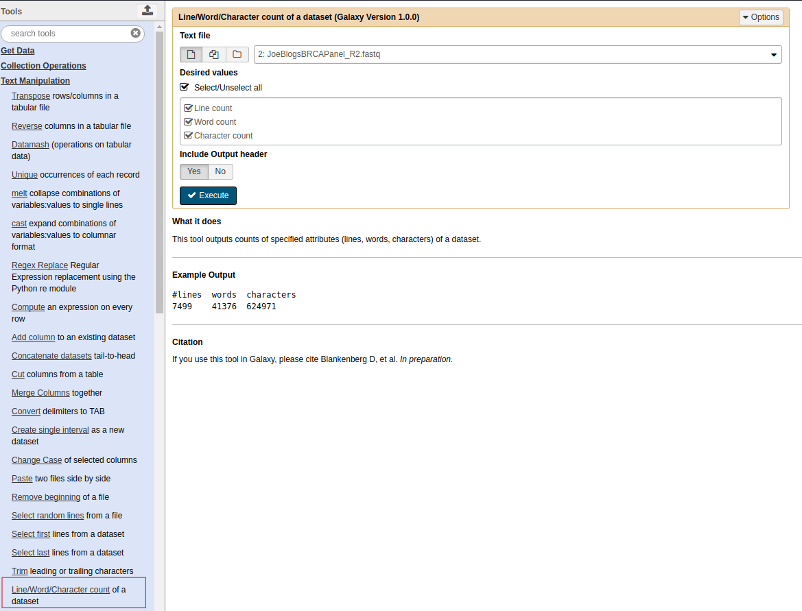

## Exercise

- count how many lines are in the file `JoeBlogsBRCAPanel_R2.fastq` in total
- how many reads does this correspond to?
    
## FastQC: Quality Assessment of fastq files

- [FastQC](http://www.bioinformatics.babraham.ac.uk/projects/fastqc/) from the Babraham Institute Bioinformatics Core has emerged as the standard tool for performing quality assessment on sequencing reads; https://www.bioinformatics.babraham.ac.uk/projects/fastqc/

- The manual for `FastQC` is available [online](http://www.bioinformatics.babraham.ac.uk/projects/fastqc/Help/) and is very comprehensive 
- A *"traffic light"* system is used to draw your attention to sections of the report that require further investigation. 
- `fastqc` will not actually *do* anything to your data. If you decide to trim or remove contamination for your samples, you will need to use another tool.
- it doesn't know what type of sequencing has been performed (WGS, exome, RNA-seq), which can affect interpretation of some of the plots

## Example sections of a `fastqc` report

1) [Basic Statistics](http://www.bioinformatics.babraham.ac.uk/projects/fastqc/Help/3%20Analysis%20Modules/1%20Basic%20Statistics.html)


## Example sections of a `fastqc` report

2) [Per-base sequence quality](http://www.bioinformatics.babraham.ac.uk/projects/fastqc/Help/3%20Analysis%20Modules/2%20Per%20Base%20Sequence%20Quality.html)


## Example sections of a `fastqc` report

Ideally, the plot should look *something* like following:-

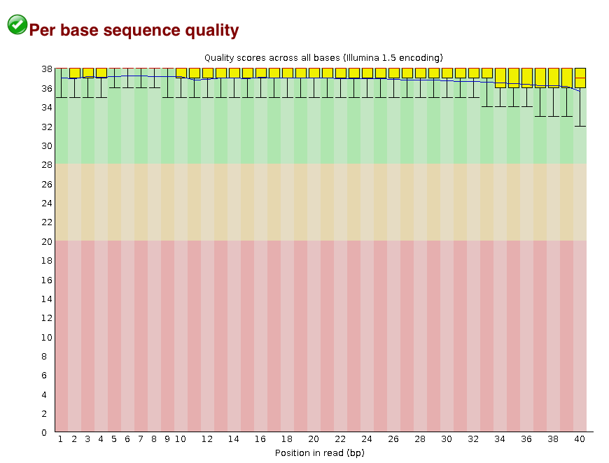

## Example sections of a `fastqc` report

3) [Per-sequence quality scores](http://www.bioinformatics.babraham.ac.uk/projects/fastqc/Help/3%20Analysis%20Modules/3%20Per%20Sequence%20Quality%20Scores.html)


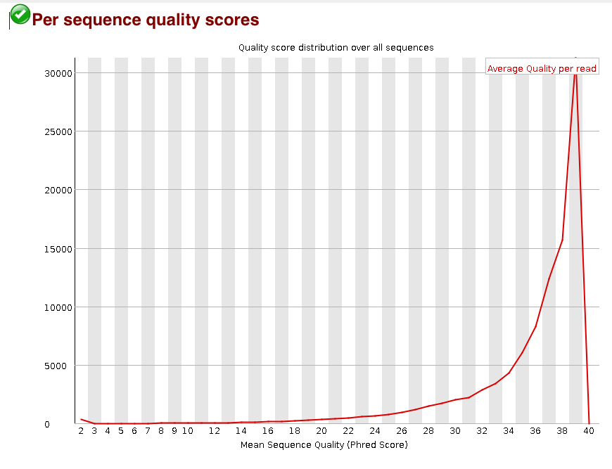

## Example sections of a `fastqc` report

[Per-base sequence content]


## Exercise

- using the Galaxy Tool *NGS: QC and manipulation* -> *FastQC Read Quality reports*

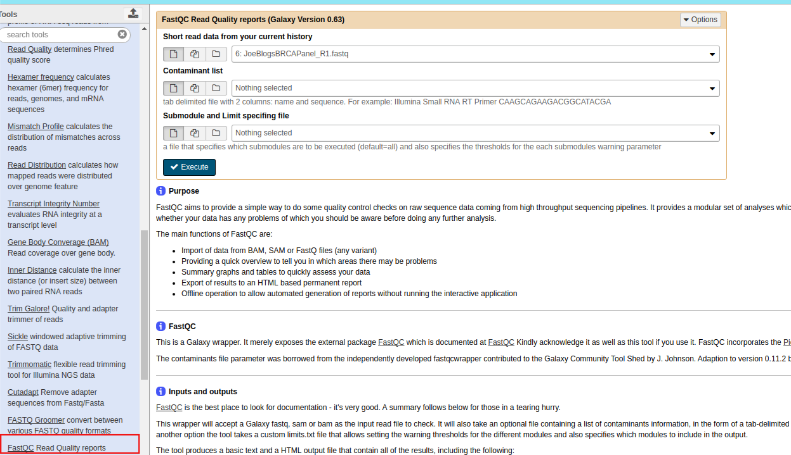

## Exercise

- generate a QC report for the file `JoeBlogsBRCAPanel_R2.fastq`
- look at the basic statistics for the file
    + does the number of reads agree with your previous answer?
- is there any evidence for a decrease in quality as the read length increases?
- See [https://www.bioinformatics.babraham.ac.uk/projects/fastqc/Help/3%20Analysis%20Modules/](https://www.bioinformatics.babraham.ac.uk/projects/fastqc/Help/3%20Analysis%20Modules/) for descriptions of various sections of report


## The SAM / BAM format

- we don't really spend much time look at *fastq* files
- most of our time is spent with *aligned* reads
    + i.e. we have used some software to tell us whereabouts in the genome each read belongs to
    + we will have a go at this in the practical
    
## The `.sam` file

- **S**equence **A**lignment/**M**ap (sam) 
- The output from an aligner such as `bwa` or `bowtie`
- Same format regardless of sequencing protocol (i.e. RNA-seq, ChIP-seq, DNA-seq etc)
- May contain un-mapped reads
- Official specification can be found online http://samtools.github.io/hts-specs/SAMv1.pdf
- We normally work on a compressed version called a `.bam` file. See later.

## The `.sam` file

Comprises a *tab-delimited* section that describes the alignment of each sequence in detail. 


- 1:- Sequence ID
- 2:- Sequence quality expressed as a bitwise *flag*
- 3:- Chromosome that the read aligned to


## Fun with flags!

The *"flags"* in the sam file can represent useful QC information

  + Read is unmapped
  + Read is paired / unpaired
  + Read failed QC
  + Read is a PCR duplicate (see later)


## Derivation

```{r echo=FALSE,warning=FALSE,message=FALSE}

flags <- c(T ,T, F,F,F,T,F,T,F,F,F)
df <- data.frame(ReadHasProperty = as.logical(flags),Binary=as.numeric(flags) ,MultiplyBy=2^(0:10))
rownames(df) <- c("Paired?", "Properly Paired?","Unmapped?","Unmapped Mate?", "On Minus Strand?","Mate on Minus Strand?","Is First Read?","Is Second Read?","Is Secondary Alignment?","Is Not Passing QC?","Is Duplicate Read?")
knitr::kable(df)
```

`r paste(df$Binary,df$MultiplyBy,sep="x",collapse=" + ")` = `r sum(df$Binary * t(df$MultiplyBy))`

https://broadinstitute.github.io/picard/explain-flags.html


## The `.sam` file


- 4:- Start Position
- 5:- Mapping Quality; Confidence that an alignment is correct
    + higher is more confident
    + 0 means read maps to multiple locations
- 6:- CIGAR; Describes number of matches (M), insertions (I), deletions (D)

## CIGAR string

**C**ompact **I**diosyncratic **G**apped **Alignment** **R**eport

- Value before **M** is number of consecutive mapping bases (can be mismatches)
- Value before **I** is number of bases inserted relative to reference
- Value before **D** is number of bases deleted relative to reference
    + e.g. 142**M**2**I**7**M** 2 bp insertion after 142 bases then 7 aligned bases


## The `.sam` file


- 7, 8, 9: Alignment information for the paired read (if available)
    + whether they align to the same chromosome
    + where the position of the paired read is 
    + how far apart did they map?

## The `.sam` file


- 10:- Sequence
- 11:- Base Qualities

- This is the same as the `fastq` file; so if you have aligned data you can always go back and re-align
- The file may also have additional (optional) information recorded by the aligner or analysis tool


## Sam and Bam

- `sam` is a human-readable file
    + which makes it quite large and unwieldy
- `bam` is the compressed binary version
    + needs special software to interrogate
    + better way of transferring data
- they contain *same* data
- the `bam` file needs to be *indexed* so we can access it more efficiently


## Exercise: Alignment

- *NGS: QC and manipulation* -> *FASTQ Groomer*

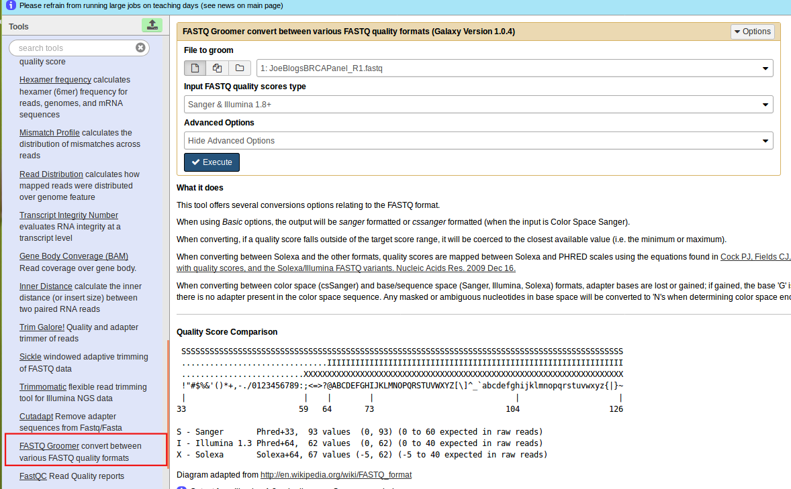

## Exercise: Alignment

- Select file to groom as `JoeBlogsBRCAPanel_R1.fastq`
    + press **Execute**
- Repeat with `JoeBlogsBRCAPanel_R2.fastq`
    
    
## Exercise: Alignment    

- *NGS: Mapping* -> *Bowtie2*

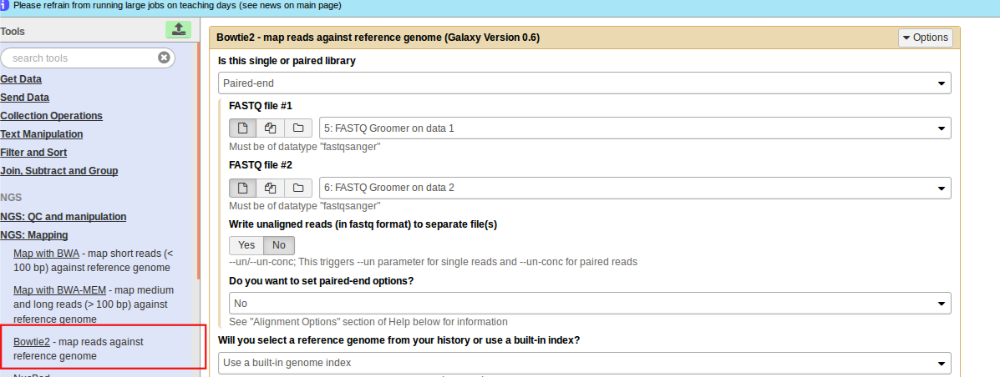    
    
## Exercise: Alignment    
    
- In *Is this single-end or Paired-end?* Select **Paired-end**
- Set *FastQ file #1* and *FastQ file #2* to the two files you created in the previous step
- Make sure the reference genome is set to **Human (Homo sapiens)(b37):hg19**
- Press *Execute*
- Wait!

## Exercise: Visualisation of reads

  - Download the `bam` file you have just created, and it's index file

  
  
  
## Exercise: Visualisation of reads
  
- Load into **IGV**
- Navigate to the BRCA1 gene and zoom-in to see the reads
- Can you see any possible mutations?
- *Hover* over particular reads to get information about the aligment of the read
- (if you didn't manage to align the data, the file `JoeBlogsBRCAPanel_bowtie2.bam` can be used)
    